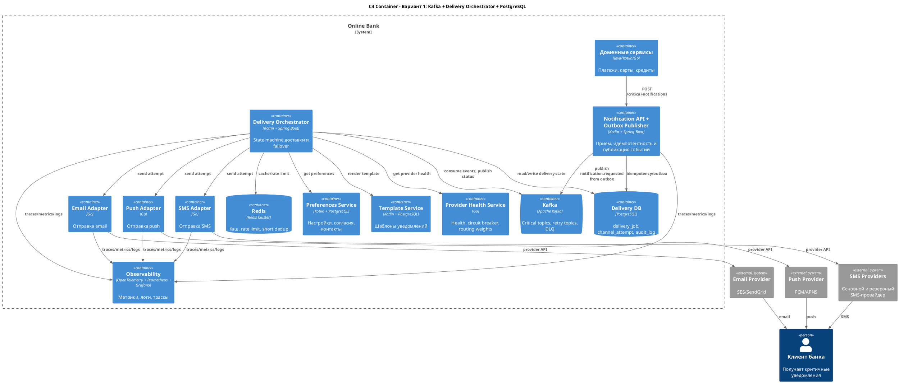
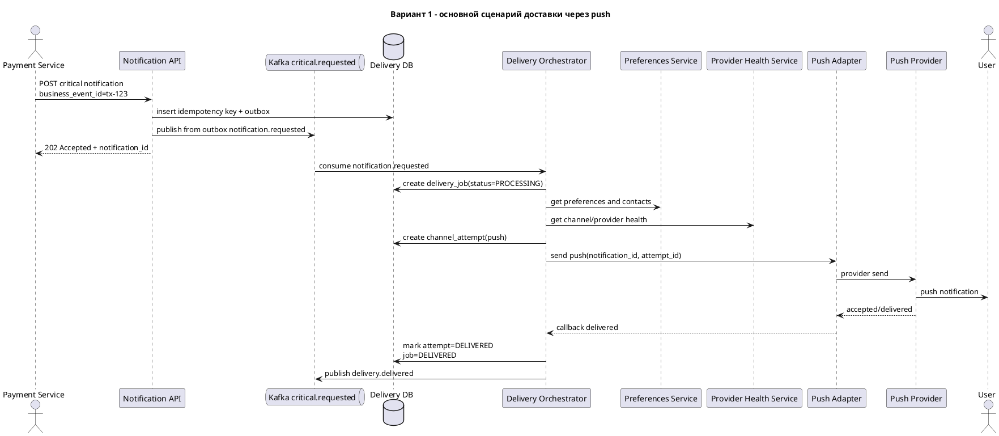
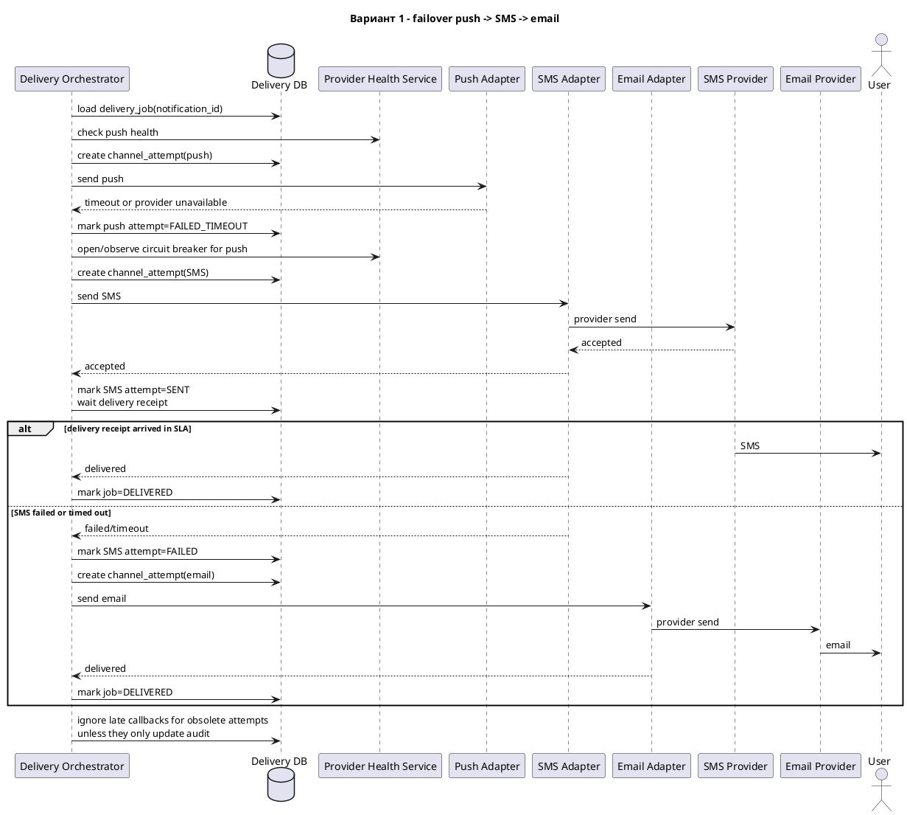
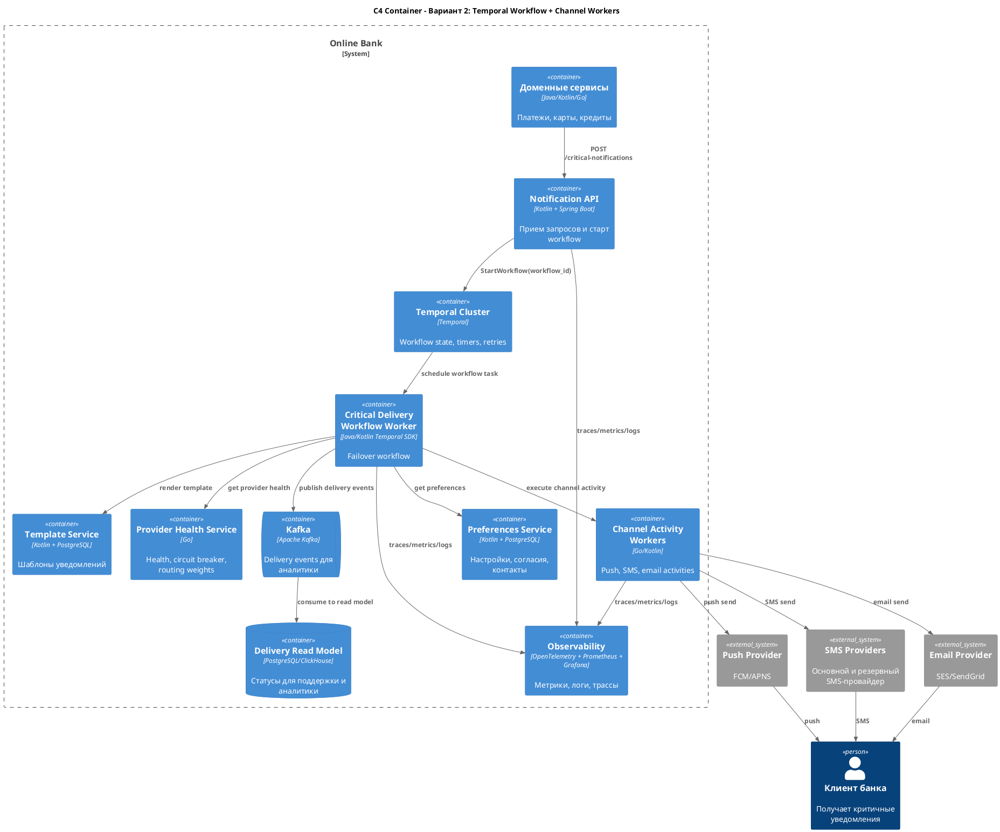
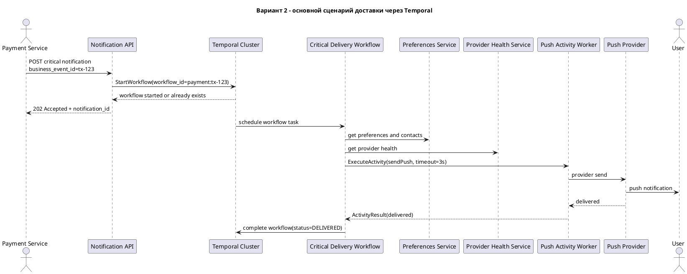
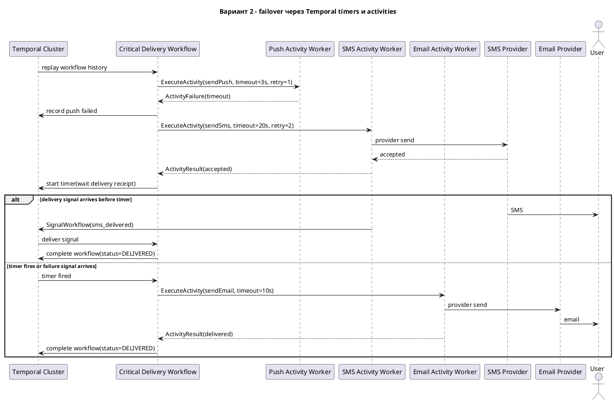

# Домашнее задание N4

## 1. Функциональные требования Notification Platform

| N | Приоритет | Обозначение | Требование |
|---|-----------|-------------|------------|
| 1 | MUST HAVE | FR1 | Система должна принимать от доменных сервисов банка запросы на отправку уведомлений с типом уведомления, пользователем, шаблоном, параметрами сообщения и бизнес-идентификатором события. |
| 2 | MUST HAVE | FR2 | Система должна классифицировать уведомления как транзакционные, сервисные или маркетинговые и применять к ним разные правила доставки. |
| 3 | MUST HAVE | FR3 | Система должна учитывать пользовательские настройки каналов: маркетинговые уведомления можно отключить полностью, сервисные можно отключить частично, критичные транзакционные нельзя отключить полностью, но можно выбрать предпочитаемый канал. |
| 4 | MUST HAVE | FR4 | Система должна доставлять критичные транзакционные уведомления хотя бы через один доступный канал и автоматически переключаться на резервный канал при отказе основного. |
| 5 | MUST HAVE | FR5 | Система должна предотвращать пользовательские дубли одного и того же уведомления при ретраях, повторных запросах от доменных сервисов и failover между каналами. |
| 6 | SHOULD HAVE | FR6 | Система должна предоставлять доменным сервисам и поддержке статус доставки и аудит действий по критичным уведомлениям. |
| 7 | SHOULD HAVE | FR7 | Система должна поддерживать массовые кампании до 1 млн пользователей с сегментацией, планированием времени отправки и ограничением частоты контактов. |

## 2. Нефункциональные требования

| N | Приоритет | Обозначение | Требование |
|---|-----------|-------------|------------|
| 1 | MUST HAVE | NFR1 | Для транзакционных уведомлений первая попытка доставки должна начинаться не позднее 1 секунды на p95 и 3 секунд на p99 после принятия запроса платформой. |
| 2 | MUST HAVE | NFR2 | Для критичных уведомлений хотя бы один успешный канал должен быть достигнут за 30 секунд на p95 и за 2 минуты на p99 при наличии доступного канала и контакта пользователя. |
| 3 | MUST HAVE | NFR3 | Доступность API приема критичных уведомлений и подсистемы доставки должна быть не ниже 99.95% в месяц; RPO при отказе одного узла - 0, RPO при крупной аварии - не более 1 минуты, RTO - не более 15 минут. |
| 4 | MUST HAVE | NFR4 | Платформа должна выдерживать не менее 5 000 запросов уведомлений в секунду и 15 000 попыток доставки в каналы в секунду в пике с возможностью горизонтального масштабирования. |
| 5 | MUST HAVE | NFR5 | Доля видимых пользователю дублей критичных уведомлений должна быть не выше 0.01% от числа критичных уведомлений за сутки. |
| 6 | MUST HAVE | NFR6 | Система должна обнаруживать деградацию внешнего провайдера не позднее 30 секунд и автоматически ограничивать или прекращать отправку в деградирующий маршрут. |
| 7 | MUST HAVE | NFR7 | Для ключевых операций должны быть доступны метрики, логи, трассировка и аудируемое шифрованное хранение персональных данных. |

### Расчет нагрузки

Исходные данные:

- MAU: 10 млн пользователей.
- DAU: 3 млн пользователей.
- Peak Concurrent Users: 300 000 пользователей.
- В день на активного пользователя: 2 транзакционных, 3 сервисных, 5 маркетинговых уведомлений.

Расчет среднего потока:

```text
Транзакционные: 3 000 000 * 2 = 6 000 000 уведомлений/день ~= 69 уведомлений/с
Сервисные:      3 000 000 * 3 = 9 000 000 уведомлений/день ~= 104 уведомления/с
Маркетинговые:  3 000 000 * 5 = 15 000 000 уведомлений/день ~= 174 уведомления/с
Итого:          30 000 000 уведомлений/день ~= 347 уведомлений/с
```

Пиковая оценка:

```text
Пиковый коэффициент для транзакционных уведомлений: 10x среднего = ~700 запросов/с
Массовая кампания на 1 000 000 пользователей за 30 минут = ~556 запросов/с
Запас на ретраи, failover, сезонные пики и рост: целевой лимит 5 000 запросов/с
Попытки в каналы при ретраях и failover: до 3 попыток на уведомление = 15 000 попыток/с
```

## 3. Архитектурно значимые требования (ASR)

| ASR | Связанные требования | Почему влияет на архитектуру |
|-----|----------------------|------------------------------|
| ASR1. Низкая задержка критичной доставки | FR4, FR5, NFR1, NFR2 | Требует выделенного критичного контура, приоритетной обработки, быстрых проверок предпочтений, коротких таймаутов и отказа от синхронной цепочки с большим числом внешних зависимостей. |
| ASR2. Надежность и отсутствие потерь критичных уведомлений | FR4, FR6, NFR3, NFR7 | Требует durable storage, идемпотентности, ретраев, восстановления после отказов, аудита статусов и проектирования конечного автомата доставки. |
| ASR3. Масштабируемость под пики и массовые кампании | FR7, NFR4 | Требует очередей, backpressure, квот, горизонтального масштабирования воркеров, отделения массового маркетингового трафика от критичного трафика. |
| ASR4. Failover между каналами без дублей и лишней стоимости | FR3, FR4, FR5, NFR5, NFR6 | Требует маршрутизатора каналов, health-check внешних провайдеров, idempotency keys, deduplication store и политики, которая учитывает предпочтения пользователя, SLA и стоимость канала. |

## 4. Ключевые архитектурные вопросы

| N | Вопрос | Требования/ASR | Почему важен |
|---|--------|----------------|--------------|
| 1 | Должна ли доставка быть синхронной из API или асинхронной через брокер и оркестратор? | ASR1, ASR2, ASR3 | Синхронная цепочка проще, но не выдерживает провайдерские таймауты и не дает надежного восстановления. Асинхронная модель требует больше компонентов, но дает надежность и масштабирование. |
| 2 | Как выбирать стратегию failover: последовательную, параллельную или гибридную? | ASR1, ASR4 | Параллельная отправка снижает задержку, но увеличивает стоимость SMS и риск дублей. Последовательная дешевле, но может не уложиться в SLA. |
| 3 | Где хранить состояние доставки: в собственной БД оркестратора, в workflow engine или только в событиях брокера? | ASR2, ASR4 | От этого зависит восстановление после сбоев, дедупликация, аудит, сложность разработки и операционная нагрузка. |

## 5. Архитектурные последствия ASR

| ASR | Архитектурные последствия |
|-----|---------------------------|
| ASR1 | Отдельные topic/queue для critical-трафика; приоритетные consumer groups; кэш предпочтений; короткие provider timeout; отдельные autoscaling policy; минимизация операций в горячем пути. |
| ASR2 | Durable broker; persistency для delivery job; outbox/inbox pattern; идемпотентность по business_event_id; DLQ; replay; резервирование БД; runbook восстановления. |
| ASR3 | Kafka/Pulsar как буфер; горизонтальные воркеры доставки; rate limiter; campaign scheduler; квоты на провайдеров; backpressure; раздельные лимиты для типов уведомлений. |
| ASR4 | Delivery state machine; channel routing policy; provider health service; circuit breaker; дедупликация по notification_id и channel_attempt_id; подавление поздних callback от уже неактуального канала. |

## 6. Архитектурные решения, которые не подходят

| Решение | Какой ASR нарушается | Почему не подходит |
|---------|----------------------|--------------------|
| Оставить отправку уведомлений в каждом доменном сервисе | ASR2, ASR4 | Не будет централизованной дедупликации, единых правил предпочтений, аудита и failover. Команды продолжат по-разному работать с провайдерами и создавать дубли. |
| Синхронно вызывать push/SMS/email провайдеров прямо из API Notification Platform без durable очереди и состояния | ASR1, ASR2, ASR3 | При таймаутах провайдеров API будет блокироваться, потеряет запросы при сбое процесса и не сможет надежно продолжить delivery job после рестарта. |

## 7. Неопределенности и архитектурные риски

| N | Что неизвестно | Риск | Как проверить |
|---|----------------|------|---------------|
| 1 | Юридические границы отключения сервисных и критичных уведомлений | Можно нарушить согласия пользователей или требования регулятора | Провести ревью с legal/compliance и зафиксировать матрицу типов уведомлений и разрешенных каналов |
| 2 | Реальные задержки и качество delivery receipt у SMS/email провайдеров | Failover может срабатывать слишком рано или поздно, создавая стоимость и дубли | Провести нагрузочный пилот с 2-3 провайдерами и собрать p50/p95/p99 latency, error rate и полноту callback |
| 3 | Качество контактных данных и push token | SLA доставки может не выполняться у пользователей без валидного канала | Измерить долю пользователей с валидным push token, телефоном и email; добавить регулярную валидацию контактов |

---

# RFC: Гарантированная доставка критичных уведомлений с кросс-канальным failover

| Метаданные | Значение                                        |
|------------|-------------------------------------------------|
| **Статус** | DRAFT                                           |
| **Автор(ы)** | Никита Поливин                                  |
| **Ответственный** | Команда Notification Platform                   |
| **Бизнес-заказчик** | Online Bank Product                             |
| **Ревьюеры** | Architecture Review Board, Security, Compliance |
| **Дата создания** | 2026-04-07                                      |
| **Дата обновления** | 2026-04-07                                      |

## Оглавление

1. [Контекст](#контекст)
2. [Продуктовый анализ](#продуктовый-анализ)
3. [Пользовательские сценарии](#пользовательские-сценарии)
4. [Статистика](#статистика)
5. [Требования](#требования)
6. [Варианты решения](#варианты-решения)
7. [Сравнительный анализ](#сравнительный-анализ)
8. [Выводы](#выводы)
9. [Связанные задачи](#связанные-задачи)
10. [Приложения](#приложения)

## Контекст

Сейчас доменные команды банка отправляют уведомления самостоятельно. Из-за этого нет единого контроля над retry, deduplication, пользовательскими настройками, провайдерскими отказами и аудитом доставки. Для критичных транзакционных уведомлений это создает прямой риск: пользователь может не получить подтверждение перевода, списание средств или предупреждение о важном действии.

Предложение описывает подсистему в составе Notification Platform, которая отвечает именно за критичные транзакционные уведомления. Цель - доставить каждое принятое критичное уведомление хотя бы через один доступный канал, автоматически переключаться между push, SMS и email, не создавать видимые дубли и не использовать дорогие каналы без необходимости.

### Ограничение понятия "гарантированная доставка"

Абсолютную физическую доставку пользователю гарантировать нельзя: у пользователя может не быть связи, все контакты могут быть невалидны, а все внешние провайдеры могут быть недоступны. В этом RFC "гарантия" означает:

- платформа не теряет принятое критичное уведомление при отказе одного узла; для крупных аварий действует RPO;
- при отказе основного канала платформа автоматически пробует резервный канал;
- каждый шаг имеет аудит и причину итогового статуса;
- пользователь не получает видимый дубль одного и того же бизнес-события.

## Продуктовый анализ

Бизнес-цели:

- увеличить retention пользователей на 15% за счет предсказуемых, своевременных и персонализированных уведомлений;
- снизить количество жалоб на уведомления на 30% за счет дедупликации, настроек и прозрачных статусов;
- обеспечить надежную доставку критичных уведомлений для безопасности операций и доверия к онлайн-банку.

Ключевые продуктовые решения:

- Критичные транзакционные уведомления нельзя отключить полностью. Пользователь может выбрать предпочитаемый канал, но банк сохраняет право отправить через резервный канал, если основной недоступен.
- По умолчанию первым каналом считается push, но если пользователь явно выбрал другой канал, выбранный канал становится первым, а остальные - резервными.
- Маркетинговые и сервисные уведомления не должны конкурировать с critical delivery за ресурсы.

## Пользовательские сценарии

| Приоритет | Тип сценария | Действующее лицо | Сценарий |
|-----------|--------------|------------------|----------|
| MUST HAVE | Критичное уведомление | Пользователь банка | После списания средств пользователь получает уведомление через предпочитаемый доступный канал. |
| MUST HAVE | Failover | Пользователь банка | Если предпочитаемый канал недоступен, пользователь получает то же критичное уведомление через следующий доступный канал, например SMS или email. |
| MUST HAVE | Повторный запрос | Доменный сервис | Если сервис платежей повторно отправил запрос с тем же business_event_id, платформа не создает новое пользовательское уведомление, а возвращает текущий статус исходного delivery job. |
| MUST HAVE | Статус доставки | Сотрудник поддержки | Поддержка видит историю попыток доставки по операции: канал, провайдер, время, статус, причину failover и итог. |
| SHOULD HAVE | Провайдерская авария | Дежурный инженер | При росте ошибок SMS-провайдера система открывает circuit breaker, переключает трафик на резервного SMS-провайдера и создает алерт. |

## Статистика

### Пользователи и уведомления

| Метрика | Значение |
|---------|----------|
| MAU | 10 млн пользователей |
| DAU | 3 млн пользователей |
| Peak Concurrent Users | 300 000 пользователей |
| Уведомления на активного пользователя | 2 транзакционных, 3 сервисных, 5 маркетинговых в день |
| Все уведомления | 30 млн в день, среднее ~347 уведомлений/с |
| Критичные уведомления | 6 млн в день, среднее ~69 уведомлений/с |

### Capacity targets для подсистемы critical delivery

```text
Средний critical traffic: 6 000 000 / 86 400 = ~69 notification request/s
Пиковый critical traffic с коэффициентом 10x: ~700 notification request/s
Целевой capacity с запасом: 5 000 notification request/s
Максимум попыток на 1 critical notification: push + SMS + email = 3 channel attempts
Целевой capacity channel adapters: 15 000 channel attempt/s
```

## Требования

### Функциональные требования

| N | Приоритет | Обозначение | Требование |
|---|-----------|-------------|------------|
| 1 | MUST HAVE | RFC-FR1 | Принимать critical notification request с notification_id, business_event_id, user_id, type, priority, template_id и payload. |
| 2 | MUST HAVE | RFC-FR2 | Проверять идемпотентность по паре source_service + business_event_id и не создавать повторную доставку для дублей запроса. |
| 3 | MUST HAVE | RFC-FR3 | Получать пользовательские настройки и валидные контакты перед выбором канала. |
| 4 | MUST HAVE | RFC-FR4 | Строить порядок каналов доставки с учетом предпочтений пользователя, доступности каналов, стоимости и SLA. |
| 5 | MUST HAVE | RFC-FR5 | Выполнять автоматический failover между push, SMS и email при ошибке, таймауте, невалидном контакте или деградации провайдера. |
| 6 | MUST HAVE | RFC-FR6 | Хранить состояние delivery job и channel attempts для аудита, восстановления и подавления дублей. |
| 7 | SHOULD HAVE | RFC-FR7 | Предоставлять API статуса доставки для доменных сервисов и службы поддержки. |

### Нефункциональные требования

| N | Приоритет | Обозначение | Требование |
|---|-----------|-------------|------------|
| 1 | MUST HAVE | RFC-NFR1 | p95 задержки от приема запроса до первой попытки канала - <= 1 секунда; p99 - <= 3 секунды. |
| 2 | MUST HAVE | RFC-NFR2 | p95 времени до успешной доставки хотя бы в один канал - <= 30 секунд; p99 - <= 2 минуты при наличии доступного контакта и провайдера. |
| 3 | MUST HAVE | RFC-NFR3 | Доступность critical delivery API и worker pool - 99.95% в месяц. |
| 4 | MUST HAVE | RFC-NFR4 | Пропускная способность - 5 000 critical notification request/s и 15 000 channel attempt/s в пике. |
| 5 | MUST HAVE | RFC-NFR5 | RPO при отказе одного узла - 0, RPO при крупной аварии - <= 1 минута, RTO critical delivery - <= 15 минут. |
| 6 | MUST HAVE | RFC-NFR6 | Видимые дубли critical notification - <= 0.01% в сутки. |
| 7 | MUST HAVE | RFC-NFR7 | Provider degradation detection - <= 30 секунд; метрики, логи и трассы покрывают основной путь доставки и failover. |

### Архитектурно значимые требования и приоритеты

| Приоритет | ASR | Связанные требования | Критерий приемки |
|-----------|-----|----------------------|------------------|
| P0 | ASR1. Низкая задержка критичной доставки | RFC-FR4, RFC-FR5, RFC-NFR1, RFC-NFR2 | p95 первой попытки <= 1 секунда, p95 успешного канала <= 30 секунд |
| P0 | ASR2. Надежность и восстановление | RFC-FR2, RFC-FR6, RFC-FR7, RFC-NFR3, RFC-NFR5 | Принятый delivery job восстанавливается после падения worker без ручной повторной отправки |
| P0 | ASR3. Failover без пользовательских дублей | RFC-FR5, RFC-FR6, RFC-NFR6, RFC-NFR7 | Повторные запросы и поздние callback не создают новое видимое уведомление |
| P1 | ASR4. Масштабирование под пики | RFC-NFR4 | Система проходит нагрузочный тест 5 000 request/s и 15 000 attempt/s |

## Варианты решения

### Вариант 1: Kafka + Delivery Orchestrator + PostgreSQL

> **Описание:** Централизованный оркестратор доставки хранит состояние каждого critical delivery job в PostgreSQL, получает команды через Kafka, вызывает channel adapters и принимает provider callbacks. Failover реализуется конечным автоматом доставки.

#### Архитектура

Контейнеры:

- Notification API + Outbox Publisher - принимает запросы доменных сервисов, валидирует схему, записывает idempotency key и outbox entry, затем публикует событие в Kafka из outbox.
- Kafka - durable broker для critical notification events, retry topics, callback events и DLQ.
- Delivery Orchestrator - основной stateful-сервис доставки, который выбирает канал, создает channel attempt, планирует retry/failover и переводит delivery job между статусами.
- Preferences Service и Template Service - дают настройки, контакты и шаблон сообщения.
- Provider Health Service сообщает состояние провайдеров, а Channel Adapters скрывают API push/SMS/email провайдеров.
- PostgreSQL - основная транзакционная БД delivery_job, channel_attempt, idempotency_key и audit_log; партиционирование по дате.
- Redis и Observability stack - кэш, rate limit, метрики, логи и трассировка.



#### Основной сценарий доставки

На диаграмме показан пример, когда выбранный маршрут начинается с push. Если пользователь выбрал SMS как предпочитаемый канал, первый channel attempt будет SMS, а failover-порядок перестроится по той же routing policy.



#### Сценарий failover

Ниже показан частный случай `push -> SMS -> email`, а не единственно возможный порядок каналов.



#### Как вариант 1 выполняет ASR

| ASR | Выполнение |
|-----|------------|
| ASR1 | Критичный трафик идет через отдельные Kafka topics и отдельный worker pool. Preferences кэшируются в Redis. Таймаут первого канала настраивается так, чтобы fallback успевал в 30 секунд p95. |
| ASR2 | Delivery job и attempts хранятся в PostgreSQL до вызова провайдера и после callback. Kafka дает replay, DLQ и backpressure. Idempotency key защищает от повторных запросов. |
| ASR3 | State machine допускает только один terminal success для notification_id. Поздние callback пишутся в audit, но не создают новый пользовательский action. |
| ASR4 | Kafka partitions и stateless orchestrator workers масштабируются горизонтально. Delivery DB партиционируется по дате и user_id/notification_id. |

#### Конкретные технологии

| Компонент | Технология |
|-----------|------------|
| API и Orchestrator | Kotlin, Spring Boot, gRPC/REST |
| Broker | Apache Kafka, отдельные topics `critical.requested`, `critical.retry`, `critical.callback`, `critical.dlq` |
| DB | PostgreSQL 16, partitioning по `created_at`, logical replication, read replicas |
| Cache/rate limit | Redis Cluster |
| Channel adapters | Go или Kotlin services в Kubernetes |
| Provider integrations | FCM/APNS, 2 SMS-провайдера, AWS SES или SendGrid |
| Observability и secrets | OpenTelemetry, Prometheus, Grafana, Loki/ELK, Vault или cloud KMS |

#### Масштаб системы и ожидаемая нагрузка

- 5 000 critical request/s на API и Kafka producer.
- 15 000 channel attempt/s на суммарные adapters.
- Kafka: минимум 48 partitions для critical topics на старте, увеличение до 96 при росте.
- Orchestrator: 30-50 pod в пике при целевой производительности 100-200 job/s на pod.
- PostgreSQL: партиционирование по дню, горячие данные 90 дней, архив в объектное хранилище.

#### Этапы реализации

| Этап | Описание | Планируемый срок | Ресурсы | Риски |
|------|----------|------------------|---------|-------|
| 1 | Notification API, idempotency, Kafka topics, базовый delivery_job | 3 недели | 2 backend, 1 SRE | Ошибка в модели идемпотентности |
| 2 | Push/SMS/email adapters, provider callbacks, audit | 4 недели | 3 backend, 1 QA | Нестабильность provider API |
| 3 | Failover state machine, observability и нагрузочные тесты | 5 недель | 3 backend, 1 SRE, 1 QA | Дубли из-за поздних callback |

#### Преимущества

- Прозрачная и контролируемая модель состояния доставки.
- Kafka хорошо подходит для пиков, backpressure, replay и разделения критичного/массового трафика.
- PostgreSQL проще для аудита, расследований и транзакционной идемпотентности.

#### Недостатки

- Оркестрацию retry, timers и race condition нужно реализовать и сопровождать самостоятельно.
- PostgreSQL может стать узким местом без аккуратного партиционирования и контроля write amplification.
- Нужно отдельно проектировать scheduler для отложенных retry и timeout.

---

### Вариант 2: Temporal Workflow + Channel Workers

> **Описание:** Каждое критичное уведомление запускается как workflow в Temporal. Temporal хранит состояние, таймеры, retries и сигналы от callback, а channel workers выполняют activity для push, SMS и email.

#### Архитектура

Контейнеры:

- Notification API - принимает запрос, проверяет идемпотентность и стартует Temporal workflow с workflow_id, основанным на source_service + business_event_id.
- Temporal Cluster - хранит history workflow, timers, retries и гарантирует продолжение workflow после падения worker.
- Critical Delivery Workflow Worker - выполняет логику выбора каналов, timeout, failover и terminal status.
- Activity Workers / Channel Adapters - выполняют конкретные вызовы провайдеров.
- Preferences Service, Template Service и Provider Health Service - дают данные для routing decision.
- Delivery Read Model DB и Kafka - дают статусы для поддержки, аналитики и интеграций.



#### Основной сценарий доставки

На диаграмме показан пример доставки через push. При пользовательском предпочтении SMS workflow сначала выполнит SMS activity.



#### Сценарий failover

Ниже показан частный случай `push -> SMS -> email`; реальный порядок каналов вычисляется из предпочтений пользователя, состояния провайдеров и SLA.



#### Как вариант 2 выполняет ASR

| ASR | Выполнение |
|-----|------------|
| ASR1 | Temporal workflow быстро стартует delivery logic, а timers позволяют точно ограничивать время ожидания канала. Hot path зависит от доступности Temporal Cluster. |
| ASR2 | Temporal хранит history workflow и продолжает выполнение после падения worker. Workflow_id на основе business_event_id дает идемпотентный старт. |
| ASR3 | Workflow хранит единственный terminal state. Activity должны быть идемпотентны через attempt_id, потому что Temporal может повторить activity после таймаута. |
| ASR4 | Temporal worker pool масштабируется горизонтально, но сам Temporal Cluster должен выдерживать 6 млн workflow/day и пиковые timers. |

#### Конкретные технологии

| Компонент | Технология |
|-----------|------------|
| Workflow engine | Temporal Cluster |
| Workflow worker | Kotlin/Java Temporal SDK |
| Activity workers | Go/Kotlin services |
| DB Temporal | PostgreSQL или Cassandra/ScyllaDB в зависимости от требуемого масштаба |
| Delivery read model | PostgreSQL для поддержки, ClickHouse для аналитики |
| Event bus | Apache Kafka для downstream events |
| Observability и secrets | Temporal Web, OpenTelemetry, Prometheus, Grafana, Loki/ELK, Vault или cloud KMS |

#### Масштаб системы и ожидаемая нагрузка

- 6 млн critical workflow/day в среднем.
- Пик: 5 000 workflow starts/s при аварийных или сезонных всплесках.
- До 3 channel activities на workflow, то есть до 15 000 activity/s в пике.
- Для production нужен отдельный Temporal namespace и worker pools для critical delivery.

#### Этапы реализации

| Этап | Описание | Планируемый срок | Ресурсы | Риски |
|------|----------|------------------|---------|-------|
| 1 | Развернуть Temporal, namespace, workflow skeleton, idempotent StartWorkflow | 4 недели | 2 backend, 2 SRE | Недостаточная экспертиза Temporal |
| 2 | Реализовать push/SMS/email activities и callback signals | 4 недели | 3 backend, 1 QA | Дубли при неидемпотентных activity |
| 3 | Read model, Kafka events, нагрузочные тесты и DR | 5 недель | 2 backend, 2 SRE, 1 QA | Стоимость и сложность эксплуатации кластера |

#### Преимущества

- Timers, retries, replay и recovery уже являются частью workflow engine.
- Код delivery logic ближе к бизнес-процессу и проще читается как сценарий.
- Меньше собственной инфраструктурной логики для retry scheduler и восстановления.

#### Недостатки

- Temporal становится критичной платформенной зависимостью и требует сильной эксплуатационной экспертизы.
- Высокий поток коротких workflow может быть дороже и сложнее, чем Kafka + stateless workers.
- Нужно строго проектировать идемпотентность activity, иначе повтор activity после timeout может создать дубль у внешнего провайдера.

## Сравнительный анализ

### Ресурсные требования

| Критерий | Вариант 1: Kafka + Orchestrator | Вариант 2: Temporal Workflow |
|----------|----------------------------------|-------------------------------|
| Время реализации MVP | 14 недель | 15 недель |
| Команда | 3 backend, 1 SRE, 1 QA | 3 backend, 2 SRE, 1 QA |
| Инфраструктура | Kafka, PostgreSQL, Redis, adapters, observability | Temporal, PostgreSQL/Cassandra, Kafka для событий, Redis, adapters, observability |
| Операционная сложность | Средняя: больше собственного кода, но стандартные компоненты | Высокая: меньше собственного scheduler-кода, но сложнее платформа Temporal |
| Риск узкого места | Delivery DB и scheduler retry | Temporal history store и timers |
| Стоимость | Ниже при наличии Kafka/PostgreSQL в банке | Выше из-за Temporal cluster и экспертизы |

### Соответствие требованиям

| Требование | Вариант 1 | Вариант 2 |
|------------|-----------|-----------|
| Прием и идемпотентность | Да, через PostgreSQL unique key | Да, через workflow_id |
| Preferences и routing policy | Да | Да |
| Cross-channel failover | Да, через state machine | Да, через workflow timers |
| Delivery state и аудит | Да, в Delivery DB | Да, в Temporal history + read model |
| Latency SLO: первая попытка <= 1 секунда, доставка p95 <= 30 секунд | Да | Да |
| 5 000 request/s и 15 000 attempt/s | Да, проще масштабировать broker/workers | Возможно, но нужен capacity test Temporal |
| RPO/RTO и availability | Да, при HA Kafka/PostgreSQL | Да, при HA Temporal и БД workflow engine |
| Observability | Да | Да |

### Ключевые trade-off

| Компромисс | Вывод |
|------------|-------|
| Стоимость SMS против latency | По умолчанию не отправляем SMS параллельно с push. Если SMS выбран пользователем как preferred channel, начинаем с SMS; иначе используем SMS как fallback после короткого таймаута первого канала. |
| Простота реализации против надежности | Нельзя оставлять доставку синхронной и stateless. Нужен durable delivery state независимо от выбранного варианта. |
| Kafka state machine против Temporal | Kafka + PostgreSQL лучше соответствует уже типовым банковским компонентам и high-throughput event processing. Temporal удобнее для workflow, но требует зрелой эксплуатации и capacity validation. |
| Гарантия доставки против пользовательских настроек | Критичные уведомления нельзя отключить полностью; пользовательские предпочтения влияют на порядок каналов, но не блокируют fallback для безопасности. |

## Выводы

> **Рекомендация:** выбрать вариант 1 - Kafka + Delivery Orchestrator + PostgreSQL.

### Обоснование выбора

Вариант 1 лучше подходит для текущего масштаба и требований онлайн-банка. Основная нагрузка - высокочастотные короткие операции доставки, для которых Kafka и горизонтальные workers являются естественной моделью. PostgreSQL дает понятный аудит, транзакционную идемпотентность и удобное расследование инцидентов по notification_id или business_event_id.

Temporal полезен, если в банке уже есть зрелая Temporal-платформа и команда умеет эксплуатировать ее как P0-зависимость. Если такой платформы нет, внедрение Temporal ради одного сценария увеличит операционный риск. Для данного задания Temporal остается сильным альтернативным вариантом, но требует отдельного capacity test на 5 000 workflow starts/s, 15 000 activity/s и большое число timers.

### Ограничения выбранного решения

- Необходимо аккуратно реализовать state machine и тестировать race condition: поздние callback, повторные запросы, retry после падения worker, частичные ошибки БД.
- Нужно заранее спроектировать партиционирование Delivery DB, иначе audit_log и channel_attempt станут узким местом.
- "Гарантия доставки" ограничена наличием хотя бы одного доступного канала и корректного контакта пользователя.

## Связанные задачи

| N | Задача | Приоритет |
|---|--------|-----------|
| 1 | Согласовать с legal/compliance матрицу отключаемости уведомлений | P0 |
| 2 | Выбрать и протестировать минимум двух SMS-провайдеров | P0 |
| 3 | Описать delivery state machine и таблицы delivery_job/channel_attempt/audit_log | P0 |
| 4 | Провести нагрузочный тест 5 000 request/s и 15 000 attempt/s | P0 |

## Приложения

### Глоссарий

| Термин | Определение |
|--------|-------------|
| Critical notification | Транзакционное уведомление, недоставка которого влияет на безопасность, доверие пользователя или корректность информирования об операции. |
| Delivery job | Сущность, описывающая жизненный цикл доставки одного уведомления одному пользователю. |
| Channel attempt | Одна попытка отправки delivery job через конкретный канал и провайдера. |
| Failover | Автоматический переход на резервный канал или провайдера при ошибке, таймауте или деградации текущего маршрута. |
| Idempotency key | Ключ, позволяющий безопасно обрабатывать повторный запрос как тот же бизнес-событие, а не как новое уведомление. |
